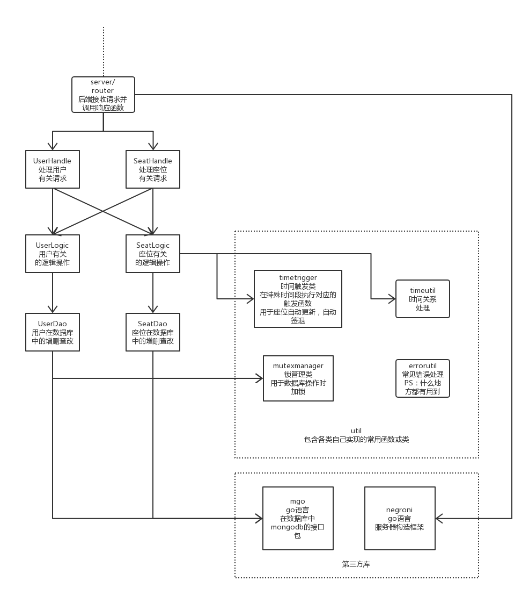

# go-server

> 开发者：胡子昂，黄敏仪，林彬彬

##项目介绍

- 图书馆座位管理系统的后端，用go语言实现。
- 依赖于mongodb数据库存储信息，因此运行前，需要开启mongodb数据库
- 通过Restful响应请求，并且进行响应
- 支持并发操作

## 程序架构图

## 接口：

- API接口文档: https://librarybookseatsystem.docs.apiary.io/#
- 错误码文档：https://github.com/book-library-seat-system/document/blob/master/%E5%90%8E%E7%AB%AF%E9%94%99%E8%AF%AF%E7%A0%81.md

##安装和运行说明：

- 有两种安装方式：

1. 当你已经安装了go语言时，可以命令行直接运行：

   ~~~bash
   $ go get github.com/book-library-seat-system/go-server
   ~~~

   此命令会帮助你自动安装本项目和本项目的依赖包。

   （PS：其中有一个包被墙了，需要翻墙）

   安装完毕后，可以在$GOPATH/bin中找到可执行程序，运行即可。

   ~~~bash
   $ $GOPATH/bin/go-server
   ~~~

2. 如果你没有安装go语言时，可以直接通过github下载本项目，查看exec目录。

   exec目录下有三个可执行文件，分别对应windos，linux，mac，运行即可。

## 版本信息

### v1.0

1. 实现user在数据库层面的增删查改
2. 实现seat在数据库层面的增删查改
3. 实现user-handle注册，登陆，注销，显示用户信息接口
4. 实现seat-handle返回时间段信息，返回座位信息，预约座位，取消预约座位接口

### v2.0

1. 实现seat-handle签到，签退接口
2. 实现seat-handle用户查看自己已预订座位接口
3. 实现时间窗口功能

### v3.0

1. 支持多用户，支持并发
2. 代码规范，结构重构